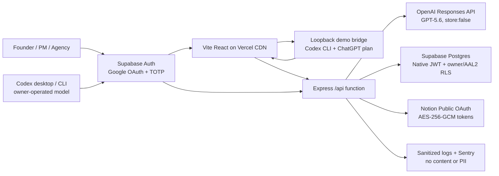

# Lumixia Brief

> Lumixia Brief does not rush to generate work from a vague prompt. It interviews until everyone can see what is known, what is assumed, and what still needs a human decision.

**Build Week track:** Work & Productivity<br>
**Primary demo:** A founder preparing a brief for Codex<br>
**Core Codex Session ID:** `019f614d-cd80-76d3-8151-b8271f575a3f`<br>
**Source:** <https://github.com/Z2ZATL/lumixia-brief><br>
**Demo URL:** <https://brief.z2zs.space>

Lumixia Brief is a React web app that turns an unclear project idea into a reviewable, versioned one-page brief. Codex local demo mode or the live GPT-5.6 provider asks one adaptive question per submitted answer, identifies facts, assumptions, and contradictions, and assesses eight clarity dimensions. The server calculates the score and decides when the brief is ready. A human must review and approve an immutable snapshot before Notion receives anything.

## Three-minute product path

1. Enter a deliberately vague idea.
2. Answer 5–12 adaptive questions, one at a time.
3. Watch confidence change across Problem, Audience, Outcome, Scope, Constraints, Timeline, Risks, and Success criteria.
4. Review a structured brief and the Alignment Improvement evidence.
5. Reject a section for a focused follow-up, or approve an immutable version.
6. Select a Notion parent page and sync the approved version idempotently.

## Architecture



- `src/` — React UI, EN/TH switch, protected app flow.
- `api/index.ts` — Vercel Express entrypoint.
- `server/domain/` — deterministic confidence, question priority, stop rules, and workflow invariants.
- `server/providers/` — live/mock OpenAI and Notion adapters.
- `server/mcp/` — authenticated Streamable HTTP tools for an owner-operated Codex session.
- `scripts/codex-bridge/` — loopback-only Codex CLI runner for the no-API-charge video demo.
- `server/store/` — in-memory test adapter and Supabase adapter using the verified Supabase JWT.
- `shared/contracts.ts` — strict Zod contracts shared by client and server.
- `supabase/migrations/` — forward-only schema and forced RLS policies.
- `tests/` — unit, API, Supabase RLS integration, and Playwright demo tests.

Vercel serves the Vite build from its CDN and rewrites `/api/*` to one Express Fluid Compute function. Docker is intentionally limited to local Supabase, integration testing, Linux/amd64 build verification, and portability checks; it is not the Vercel runtime.

## One-command local setup

Requirements: Node `24.16.x`, npm `11+`, Git, and Docker Desktop for Supabase integration tests.

```powershell
npm run setup:local
```

This installs the locked dependencies and creates `.env.local` from `.env.example` if it does not exist. The safe default uses in-memory data, deterministic providers, and a local AAL2 test identity. No third-party data is sent.

```powershell
npm run dev
```

Open `http://127.0.0.1:5173`. For local Supabase instead of memory:

```powershell
npm run supabase:start
npm run supabase:reset
```

Then set `AUTH_MODE=supabase`, `VITE_AUTH_MODE=supabase`, and `DATA_MODE=supabase`, and provide the local Supabase URL/publishable key. Local Google OAuth remains off unless you explicitly add non-production credentials; CI creates synthetic local Auth users without adding a service-role key to the app runtime.

For the owner-operated Codex demo, start a second terminal before opening **Connections**:

```powershell
npm run codex:bridge
```

The worker binds only to `127.0.0.1:8790`, uses the Codex login already stored on this computer, and never prints or persists a pairing token outside browser `sessionStorage`. Click **Connect local Codex** in Lumixia; Chrome may ask once for local-network permission. The token is cleared on sign-out.

## Environment variables

| Variable                                   | Local default  | Preview / production purpose                                   |
| ------------------------------------------ | -------------- | -------------------------------------------------------------- |
| `APP_ENV`                                  | `local`        | `preview` or `production`; controls fail-closed validation     |
| `APP_URL`, `ALLOWED_ORIGIN`                | local URL      | Exact public URL and exact accepted browser origin             |
| `AUTH_MODE`, `VITE_AUTH_MODE`              | `local-demo`   | Must both be `supabase` in Preview/Production                  |
| `MODEL_PROVIDER_MODE`                      | `mock`         | `disabled`, `mock`, or `live`; production forbids `mock`       |
| `NOTION_PROVIDER_MODE`                     | `mock`         | `mock` locally and `live` in preview/production                |
| `DATA_MODE`                                | `memory`       | Must be `supabase` in production                               |
| `VITE_SUPABASE_URL`                        | empty          | Separate staging/production Supabase project URL               |
| `VITE_SUPABASE_PUBLISHABLE_KEY`            | empty          | Public API key; protected requests also carry the active JWT   |
| `OPENAI_API_KEY`                           | empty          | Required only when `MODEL_PROVIDER_MODE=live`                  |
| `OPENAI_MODEL`                             | `gpt-5.6`      | Interview and brief model                                      |
| `CODEX_MCP_MODE`                           | `enabled`      | Enables the authenticated owner-operated Codex MCP endpoint    |
| `CODEX_LOCAL_BRIDGE_MODE`                  | `enabled`      | Allows an AAL2 browser to submit validated local-Codex results |
| `NOTION_CLIENT_ID`, `NOTION_CLIENT_SECRET` | empty          | Notion public integration credentials                          |
| `NOTION_REDIRECT_URI`                      | local callback | Exact OAuth callback registered in Notion                      |
| `TOKEN_ENCRYPTION_KEY`                     | empty          | Base64-encoded 32-byte AES-256-GCM key                         |
| `OAUTH_STATE_SECRET`                       | empty          | At least 32 random characters for signed, expiring OAuth state |
| `SENTRY_DSN`, `VITE_SENTRY_DSN`            | empty          | Optional scrubbed error/tracing destination; Replay stays off  |

Production startup rejects a mock model, mock Notion, memory data, auth bypass, or missing security/provider credentials. Until the paid model smoke test is authorized, production uses `MODEL_PROVIDER_MODE=disabled` and constructs no OpenAI client. When `CODEX_LOCAL_BRIDGE_MODE=enabled`, a paired owner browser can still run the adaptive interview through local Codex; otherwise interview and generation return the explicit `503 MODEL_NOT_CONFIGURED`. Preview uses a deterministic model mock with live Notion and staging Supabase. The protected `GET /api/capabilities` endpoint reports model, Notion, MCP, and local-bridge support.

Vercel Preview derives its exact origin from the stable `VERCEL_BRANCH_URL` system variable (falling back to `VERCEL_URL`), while Production requires an explicit `APP_URL`. This keeps CORS and OAuth callbacks aligned across new commits without hard-coding a changing deployment URL.

## Codex connection without an OpenAI API key

Lumixia Brief also exposes an owner-operated MCP connection at `https://brief.z2zs.space/api/mcp`. It lets the signed-in owner use their own Codex session to conduct the adaptive interview and draft the brief. This path does not instantiate the OpenAI API client, does not use `OPENAI_API_KEY`, and does not create OpenAI API charges for Lumixia Brief. The owner's Codex plan limits still apply.

The connection uses Supabase OAuth 2.1 consent, Google sign-in, verified TOTP, owner RLS, and per-write approval in Codex. Supabase creates a separate OAuth session at AAL1, so Lumixia records a 30-day client-specific grant only when the owner approves consent from a direct AAL2 browser session. MCP access then requires the OAuth `client_id`, `openid`, and that active grant; it is rechecked by Express and RLS on every request. A normal browser access token and an ungranted OAuth token are both rejected. The server exposes five narrow tools:

- `list_projects`
- `get_project_context`
- `create_project`
- `record_interview_turn`
- `save_brief_draft`

Codex supplies structured analysis, but the Lumixia server validates evidence, computes confidence, enforces stop rules, and owns workflow/version transitions. Approval and Notion sync remain human-only actions in the web app.

In Codex desktop, open **Settings → MCP servers → Add server**, choose Streamable HTTP, enter the endpoint above, save, and restart Codex. The equivalent Codex configuration is:

```toml
[mcp_servers.lumixia_brief]
url = "https://brief.z2zs.space/api/mcp"
auth = "oauth"
default_tools_approval_mode = "writes"
```

Then run `codex mcp login lumixia_brief` if the command-line client has not opened the consent flow automatically. Hosted setup requires Supabase OAuth Server, Dynamic Client Registration, the `/oauth/consent` authorization path, and asymmetric signing to be enabled. See [the Codex MCP runbook](docs/operations/codex-mcp.md).

### Website interview through local Codex

The Build Week video uses a second owner-operated path so the user can answer inside the website:

```text
Website answer → 127.0.0.1 Codex bridge → structured analysis
→ authenticated Lumixia API → server confidence/stop rules → next website question
```

The bridge runs `codex exec` ephemerally in an empty temporary directory with ignored user configuration, no MCP servers, `read-only` sandboxing, approval policy `never`, and strict JSON Schema output. The installed CLI is pinned as a development dependency. Only the exact Lumixia origins can call it, a memory-only pairing token is required, one operation runs at a time, and response bodies are never logged. The website posts the validated result through its existing AAL2 session; local Codex never receives the Supabase token and cannot approve or sync to Notion.

This mode uses the owner's ChatGPT/Codex plan allowance, not an OpenAI Platform API key. It is intentionally a video-demo capability: the owner's computer and worker must stay online, and it must not be exposed as a shared public inference service.

## Interview and model contract

Both runtime paths execute only after submit—never while typing. Local Codex uses low reasoning for interview turns and medium reasoning for the brief with strict JSON Schema output. Live API mode uses GPT-5.6 Responses API Structured Outputs, `store:false`, a 30-second timeout, and one retry only for 429/5xx.

The live adapter is contract-tested with an injected fake Responses client, so `store:false`, reasoning levels, schemas, retry behavior, refusal handling, and error mapping are verified without paid API usage. Enabling the live path later requires only an OpenAI key, `MODEL_PROVIDER_MODE=live`, a gated deployment, and one synthetic contract smoke test.

Every interview turn must return:

- `facts`
- `assumptions`
- `contradictions`
- exactly eight `dimensionAssessments`
- one `nextQuestion` or `null`
- `shouldStop` and `stopReason`

The model proposes; the server enforces. Question priority is blocking contradiction → missing essential dimension → lowest dimension → risk clarification. Each answer has a client UUID idempotency key. It is persisted as pending before the provider call and becomes processed or failed. A failed answer can be retried without creating another turn.

## Confidence rubric

| Level   | Points | Meaning                                         |
| ------- | -----: | ----------------------------------------------- |
| Missing |      0 | No usable information                           |
| Assumed |      1 | Inferred, not confirmed                         |
| Partial |      2 | Mentioned but not fully decision-ready          |
| Clear   |      3 | Specific and supported by cited answer evidence |

`confidence = sum(points) / 24 × 100`, rounded by the server.

Ready to brief requires:

- at least five processed answers;
- Problem, Audience, Outcome, Scope, and Success criteria at least Partial;
- at least 75% overall; and
- no unresolved blocking contradiction.

At 12 questions, generation is allowed with a **Needs clarification** label. Alignment Improvement compares the initial prompt and final interview with the same rubric and counts surfaced assumptions, resolved contradictions, and remaining human decisions. This is a transparent UX indicator—not a scientific precision metric.

## Review, approval, and Notion

Briefs use fixed structured sections instead of free-form rich text. Approval records the approver and timestamp on a versioned snapshot. Editing an approved version clones it to a new draft. Reject & revise requires a section, dimension, and reason, then reopens one focused question.

Notion uses per-user public OAuth. Access and refresh tokens are encrypted at rest with AES-256-GCM. Expired credentials refresh automatically once; a 401 retries after refresh. Notion calls time out after 15 seconds and retry 429/5xx at most twice while respecting `Retry-After`. The `(project, brief version)` sync record is unique; retry returns or updates the same page instead of creating a second page.

## Privacy and security model

- Supabase Auth is configured for Google-only sign-in; all product routes require native TOTP/AAL2. Users can enroll a second TOTP factor on another device for recovery.
- The Express layer verifies authentication, second-factor claims, input schemas, exact origins, body limits, ownership, request rate, and timeouts.
- Supabase forces RLS on every user table. Policies require JWT `sub = owner_id` plus either a direct AAL2 session or an active client-specific Codex grant created by direct AAL2 consent. Codex grants expire after 30 days and never contain tokens or project content.
- Data remains until the owner deletes the project. Project deletion cascades answer claims and sync records.
- Logs contain only request ID, route, method, status, duration, anonymous user hash, and deployment SHA.
- Request bodies, authorization/cookie headers, answers, briefs, emails, OpenAI/Notion payloads, and user identifiers are removed from Sentry. Session Replay is disabled.
- Secrets belong only in `.env.local`, GitHub encrypted secrets, or Vercel encrypted variables. `.env.example` contains names only.
- Codex MCP access is owner-scoped and stateless. OAuth clients can create and revise drafts but database policy independently blocks approval, project deletion, and all Notion tables. Tool responses omit owner IDs and Notion identifiers, and prompts, answers, briefs, OAuth tokens, and TOTP values remain excluded from logs and Build Ledger evidence.

See [docs/security/privacy-model.md](docs/security/privacy-model.md) for the threat boundaries and operator checklist.

## Verification

```powershell
npm run format:check
npm run lint
npm run typecheck
npm run test
npm run test:coverage
npm run test:integration
npm run test:e2e
npm run build
npm run audit:all
npm run audit:prod
docker build --platform linux/amd64 -t lumixia-brief:local .
```

The Supabase integration suite requires local Supabase to be active and never silently skips. Manual release checks include real Google/TOTP enrollment, Notion OAuth consent, production health, rollback rehearsal, keyboard navigation, WCAG AA contrast, and the sub-three-minute demo.

CI stores coverage, Playwright evidence, Supabase status, Trivy SARIF, CycloneDX SBOM, and a sanitized per-commit summary for 30 days.

The coverage gate measures every `server/**/*.ts` file except the process entrypoint. Global thresholds are 85% for lines/statements/functions and 75% for branches, with stricter 90% line and 85% branch gates on configuration, security, Sentry redaction, and workflow invariants.

## CI/CD and environments

- Pull requests: format, lint, typecheck, unit/API contracts, empty-DB migration, two-user MFA RLS, Playwright desktop/mobile, production build, Linux/amd64 Docker build, full and production audits, secret scan, critical image scan, and SBOM.
- Preview: Vercel Git integration, Supabase Auth/database staging, and preview-only secrets.
- Production: protected `main`, required **Required CI**, manual `production` environment approval, and a forward-only Supabase migration for the exact main SHA. Vercel Git integration is the only deployment path; GitHub Actions does not build or deploy a second copy.
- Set repository variable `PRODUCTION_RELEASE_ENABLED=true` only after every production secret and environment protection rule exists.
- Configure Vercel Deployment Checks to require the GitHub **Required CI** check before promotion.

Rollback is a Vercel deployment rollback for application code. Database rollback is always a forward repair migration; destructive migrations are forbidden before submission.

### Synthetic founder example

An operator can seed the approved, clearly labeled founder example without OpenAI. The script uses a direct staging/production database operator URL only during execution, is deterministic per owner, never prints an owner ID or credential, and refuses production unless confirmation is explicit.

```powershell
$env:SUPABASE_DB_URL = '<operator database URL>'
$env:LUMIXIA_SEED_OWNER_ID = '<authenticated Supabase user UUID>'
npm run seed:founder -- --environment=staging
# Production additionally requires: --confirm-production
```

These two operator variables are not application runtime variables and must not be added to Vercel.

## Observability

Use Vercel Observability for invocation/latency, Sentry for scrubbed React/Express errors and traces, and UptimeRobot every five minutes for `/`, `/api/health`, and `/api/ready`. Health exposes process/version/SHA; readiness checks the Supabase REST surface without reading user content.

## Build evidence and Codex usage

- [CODEX_BUILD_LOG.md](CODEX_BUILD_LOG.md) — milestone index.
- [docs/codex-build-ledger/](docs/codex-build-ledger/) — detailed sanitized evidence.
- [docs/decisions/](docs/decisions/) — architecture decision records.
- Commits use `Codex-Session:` and `Build-Ledger:` trailers.

Codex scaffolded and implemented the React/Express app, contracts, state machine, confidence rules, provider integrations, RLS migration, security middleware, UI, tests, Docker/CI, and documentation. GPT-5.6 is the runtime alignment analyst and brief generator. The Build Ledger records outputs, files, tests, commit/PR links, and the core session ID without chain-of-thought, secrets, or user content.

## Known MVP limitations

- Notion sync creates a child page; arbitrary database-property mapping is intentionally out of scope.
- Confidence measures interview completeness, not factual truth or model accuracy.
- Google-only login depends on completing the documented Google and Supabase Auth provider configuration.
- Local mock mode is deterministic evidence for development, not a substitute for the live provider smoke tests.
- The Codex MCP path is interactive. The loopback bridge makes the website autonomous only while the owner's local worker is online; neither path is a public replacement for the Responses API.
- Vercel Hobby is appropriate only for this personal, non-commercial prototype; review the plan before commercial launch.

## Troubleshooting

- **Production refuses to start:** read the missing-variable error; production deliberately fails closed.
- **API returns `MFA_REQUIRED`:** open Security, enroll or challenge a TOTP factor, and verify the refreshed Supabase token exposes `aal=aal2`.
- **RLS returns no project:** confirm the verified Supabase token `sub` matches `owner_id` and contains `aal=aal2`.
- **Answer shows failed:** the answer is already saved. Use Retry; do not submit a new client answer ID.
- **Interview asks to connect local Codex:** run `npm run codex:bridge`, open Connections, click **Connect local Codex**, and allow Chrome's local-network prompt.
- **Local Codex fails after pairing:** keep the answer in place, confirm the worker terminal is still ready, disconnect/reconnect the bridge, and retry the same turn.
- **Interview returns `MODEL_NOT_CONFIGURED`:** neither the local bridge nor paid live provider is available; no OpenAI API request was sent.
- **Codex cannot discover OAuth:** verify `/.well-known/oauth-protected-resource/api/mcp`, Supabase OAuth Server/Dynamic Client Registration, the exact `/oauth/consent` authorization path, and asymmetric JWT signing.
- **Notion shows 401:** reconnect only if automatic refresh reports `NOTION_RECONNECT_REQUIRED`.
- **OneDrive dev is slow:** keep daily Node development native; use Docker only for Supabase and portability gates.

## License

Lumixia Brief is open-source software licensed under the [Apache License 2.0](LICENSE). See [NOTICE](NOTICE) for project attribution. The `private` package flag only prevents accidental publication to the npm registry; it does not restrict the rights granted by the repository license. Connected services such as OpenAI, Supabase, Notion, Sentry, and Vercel remain subject to their own terms.

## Submission handoff

Production Google OAuth is configured through the owner-authenticated Google Cloud and Supabase consoles. Interactive Google/TOTP enrollment, real Notion consent, UptimeRobot setup, and YouTube publishing still require the owner at their respective authentication boundaries. These are tracked explicitly in [docs/submission-checklist.md](docs/submission-checklist.md). The public repository requires no private judge invitations.
