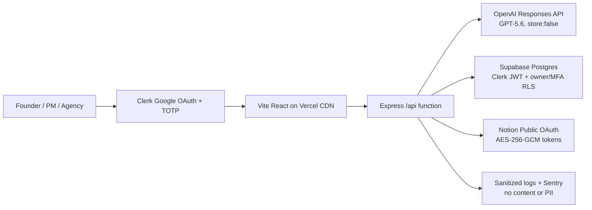

# Lumixia Brief

> Lumixia Brief does not rush to generate work from a vague prompt. It interviews until everyone can see what is known, what is assumed, and what still needs a human decision.

**Build Week track:** Work & Productivity<br>
**Primary demo:** A founder preparing a brief for Codex<br>
**Core Codex Session ID:** `019f614d-cd80-76d3-8151-b8271f575a3f`<br>
**Demo URL:** pending production credentials and Vercel handoff

Lumixia Brief is a React web app that turns an unclear project idea into a reviewable, versioned one-page brief. GPT-5.6 asks one adaptive question per submitted answer, identifies facts, assumptions, and contradictions, and assesses eight clarity dimensions. The server calculates the score and decides when the brief is ready. A human must review and approve an immutable snapshot before Notion receives anything.

## Three-minute product path

1. Enter a deliberately vague idea.
2. Answer 5–12 adaptive questions, one at a time.
3. Watch confidence change across Problem, Audience, Outcome, Scope, Constraints, Timeline, Risks, and Success criteria.
4. Review a structured brief and the Alignment Improvement evidence.
5. Reject a section for a focused follow-up, or approve an immutable version.
6. Select a Notion parent page and sync the approved version idempotently.

## Architecture



- `src/` — React UI, EN/TH switch, protected app flow.
- `api/index.ts` — Vercel Express entrypoint.
- `server/domain/` — deterministic confidence, question priority, stop rules, and workflow invariants.
- `server/providers/` — live/mock OpenAI and Notion adapters.
- `server/store/` — in-memory test adapter and Supabase adapter using the current Clerk JWT.
- `shared/contracts.ts` — strict Zod contracts shared by client and server.
- `supabase/migrations/` — forward-only schema and forced RLS policies.
- `tests/` — unit, API, Supabase RLS integration, and Playwright demo tests.

Vercel serves the Vite build from its CDN and rewrites `/api/*` to one Express Fluid Compute function. Docker is intentionally limited to local Supabase, integration testing, Linux/amd64 build verification, and portability checks; it is not the Vercel runtime.

## One-command local setup

Requirements: Node `24.16.x`, npm `11+`, Git, and Docker Desktop for Supabase integration tests.

```powershell
npm run setup:local
```

This installs the locked dependencies and creates `.env.local` from `.env.example` if it does not exist. The safe default uses in-memory data, deterministic providers, and a local AAL2 test identity. No third-party data is sent.

```powershell
npm run dev
```

Open `http://127.0.0.1:5173`. For local Supabase instead of memory:

```powershell
npm run supabase:start
npm run supabase:reset
```

Then set `DATA_MODE=supabase`, configure a Clerk Supabase JWT template, and provide the local Supabase URL/key.

## Environment variables

| Variable                                   | Local default  | Preview / production purpose                                   |
| ------------------------------------------ | -------------- | -------------------------------------------------------------- |
| `APP_ENV`                                  | `local`        | `preview` or `production`; controls fail-closed validation     |
| `APP_URL`, `ALLOWED_ORIGIN`                | local URL      | Exact public URL and exact accepted browser origin             |
| `LOCAL_AUTH_BYPASS`                        | `true`         | Forbidden in production                                        |
| `PROVIDER_MODE`                            | `mock`         | Must be `live` in production                                   |
| `DATA_MODE`                                | `memory`       | Must be `supabase` in production                               |
| `VITE_CLERK_PUBLISHABLE_KEY`               | empty          | Clerk frontend key                                             |
| `CLERK_SECRET_KEY`                         | empty          | Clerk Express verification key                                 |
| `SUPABASE_URL`                             | empty          | Separate staging/production Supabase project URL               |
| `SUPABASE_PUBLISHABLE_KEY`                 | empty          | Publishable key; requests also carry the active Clerk JWT      |
| `OPENAI_API_KEY`                           | empty          | Server-only OpenAI key                                         |
| `OPENAI_MODEL`                             | `gpt-5.6`      | Interview and brief model                                      |
| `NOTION_CLIENT_ID`, `NOTION_CLIENT_SECRET` | empty          | Notion public integration credentials                          |
| `NOTION_REDIRECT_URI`                      | local callback | Exact OAuth callback registered in Notion                      |
| `TOKEN_ENCRYPTION_KEY`                     | empty          | Base64-encoded 32-byte AES-256-GCM key                         |
| `OAUTH_STATE_SECRET`                       | empty          | At least 32 random characters for signed, expiring OAuth state |
| `SENTRY_DSN`, `VITE_SENTRY_DSN`            | empty          | Optional scrubbed error/tracing destination; Replay stays off  |

Production startup rejects mock providers, memory data, auth bypass, or missing security/provider credentials.

## Interview and model contract

One GPT-5.6 Responses API call occurs only after the user submits an answer—never while typing. Interview calls use low reasoning; final brief generation uses medium reasoning. Both use strict Structured Outputs. OpenAI requests set `store:false` and time out after 30 seconds. Only 429/5xx receives one retry.

Every interview turn must return:

- `facts`
- `assumptions`
- `contradictions`
- exactly eight `dimensionAssessments`
- one `nextQuestion` or `null`
- `shouldStop` and `stopReason`

The model proposes; the server enforces. Question priority is blocking contradiction → missing essential dimension → lowest dimension → risk clarification. Each answer has a client UUID idempotency key. It is persisted as pending before the provider call and becomes processed or failed. A failed answer can be retried without creating another turn.

## Confidence rubric

| Level   | Points | Meaning                                         |
| ------- | -----: | ----------------------------------------------- |
| Missing |      0 | No usable information                           |
| Assumed |      1 | Inferred, not confirmed                         |
| Partial |      2 | Mentioned but not fully decision-ready          |
| Clear   |      3 | Specific and supported by cited answer evidence |

`confidence = sum(points) / 24 × 100`, rounded by the server.

Ready to brief requires:

- at least five processed answers;
- Problem, Audience, Outcome, Scope, and Success criteria at least Partial;
- at least 75% overall; and
- no unresolved blocking contradiction.

At 12 questions, generation is allowed with a **Needs clarification** label. Alignment Improvement compares the initial prompt and final interview with the same rubric and counts surfaced assumptions, resolved contradictions, and remaining human decisions. This is a transparent UX indicator—not a scientific precision metric.

## Review, approval, and Notion

Briefs use fixed structured sections instead of free-form rich text. Approval records the approver and timestamp on a versioned snapshot. Editing an approved version clones it to a new draft. Reject & revise requires a section, dimension, and reason, then reopens one focused question.

Notion uses per-user public OAuth. Access and refresh tokens are encrypted at rest with AES-256-GCM. Expired credentials refresh automatically once; a 401 retries after refresh. Notion calls time out after 15 seconds and retry 429/5xx at most twice while respecting `Retry-After`. The `(project, brief version)` sync record is unique; retry returns or updates the same page instead of creating a second page.

## Privacy and security model

- Google-only sign-in is configured in Clerk; all product routes require TOTP/AAL2. Backup codes are enabled in Clerk.
- The Express layer verifies authentication, second-factor claims, input schemas, exact origins, body limits, ownership, request rate, and timeouts.
- Supabase forces RLS on every user table. Policies require both JWT `sub = owner_id` and an AAL2/TOTP claim.
- Data remains until the owner deletes the project. Project deletion cascades answer claims and sync records.
- Logs contain only request ID, route, method, status, duration, anonymous user hash, and deployment SHA.
- Request bodies, authorization/cookie headers, answers, briefs, emails, OpenAI/Notion payloads, and user identifiers are removed from Sentry. Session Replay is disabled.
- Secrets belong only in `.env.local`, GitHub encrypted secrets, or Vercel encrypted variables. `.env.example` contains names only.

See [docs/security/privacy-model.md](docs/security/privacy-model.md) for the threat boundaries and operator checklist.

## Verification

```powershell
npm run format:check
npm run lint
npm run typecheck
npm run test
npm run test:coverage
npm run test:integration
npm run test:e2e
npm run build
npm run audit:prod
docker build --platform linux/amd64 -t lumixia-brief:local .
```

The Supabase integration suite runs only with `RUN_SUPABASE_INTEGRATION=true` and local Supabase active. Manual release checks include real Google/TOTP enrollment, Notion OAuth consent, production health, rollback rehearsal, keyboard navigation, WCAG AA contrast, and the sub-three-minute demo.

CI stores coverage, Playwright evidence, Supabase status, Trivy SARIF, CycloneDX SBOM, and a sanitized per-commit summary for 30 days.

## CI/CD and environments

- Pull requests: format, lint, typecheck, unit/API contracts, empty-DB migration, two-user MFA RLS, Playwright desktop/mobile, production build, Linux/amd64 Docker build, production audit, secret scan, critical image scan, and SBOM.
- Preview: Vercel Git integration, Clerk development instance, Supabase staging, preview-only secrets.
- Production: protected `main`, required **Required CI**, manual `production` environment approval, forward-only Supabase migration, then prebuilt Vercel deployment.
- Set repository variable `PRODUCTION_RELEASE_ENABLED=true` only after every production secret and environment protection rule exists.
- Configure Vercel Deployment Checks to require the GitHub **Required CI** check before promotion.

Rollback is a Vercel deployment rollback for application code. Database rollback is always a forward repair migration; destructive migrations are forbidden before submission.

## Observability

Use Vercel Observability for invocation/latency, Sentry for scrubbed React/Express errors and traces, and UptimeRobot every five minutes for `/`, `/api/health`, and `/api/ready`. Health exposes process/version/SHA; readiness checks the Supabase REST surface without reading user content.

## Build evidence and Codex usage

- [CODEX_BUILD_LOG.md](CODEX_BUILD_LOG.md) — milestone index.
- [docs/codex-build-ledger/](docs/codex-build-ledger/) — detailed sanitized evidence.
- [docs/decisions/](docs/decisions/) — architecture decision records.
- Commits use `Codex-Session:` and `Build-Ledger:` trailers.

Codex scaffolded and implemented the React/Express app, contracts, state machine, confidence rules, provider integrations, RLS migration, security middleware, UI, tests, Docker/CI, and documentation. GPT-5.6 is the runtime alignment analyst and brief generator. The Build Ledger records outputs, files, tests, commit/PR links, and the core session ID without chain-of-thought, secrets, or user content.

## Known MVP limitations

- Notion sync creates a child page; arbitrary database-property mapping is intentionally out of scope.
- Confidence measures interview completeness, not factual truth or model accuracy.
- Google-only login and MFA enforcement depend on completing the documented Clerk dashboard configuration.
- Local mock mode is deterministic evidence for development, not a substitute for the live provider smoke tests.
- Vercel Hobby is appropriate only for this personal, non-commercial prototype; review the plan before commercial launch.

## Troubleshooting

- **Production refuses to start:** read the missing-variable error; production deliberately fails closed.
- **API returns `MFA_REQUIRED`:** enroll TOTP in Clerk Security, sign out/in, and verify the Supabase JWT template exposes `aal`, `fva`, or `amr`.
- **RLS returns no project:** confirm the active Clerk token `sub` matches `owner_id` and contains an accepted second-factor claim.
- **Answer shows failed:** the answer is already saved. Use Retry; do not submit a new client answer ID.
- **Notion shows 401:** reconnect only if automatic refresh reports `NOTION_RECONNECT_REQUIRED`.
- **OneDrive dev is slow:** keep daily Node development native; use Docker only for Supabase and portability gates.

## Submission handoff

The project cannot complete OAuth console setup, production secrets, Google/TOTP enrollment, Vercel ownership, UptimeRobot monitors, YouTube publishing, or repository permission changes without the owner. These are tracked explicitly in [docs/submission-checklist.md](docs/submission-checklist.md). Do not invite judge accounts until the owner confirms the permission change at action time.
